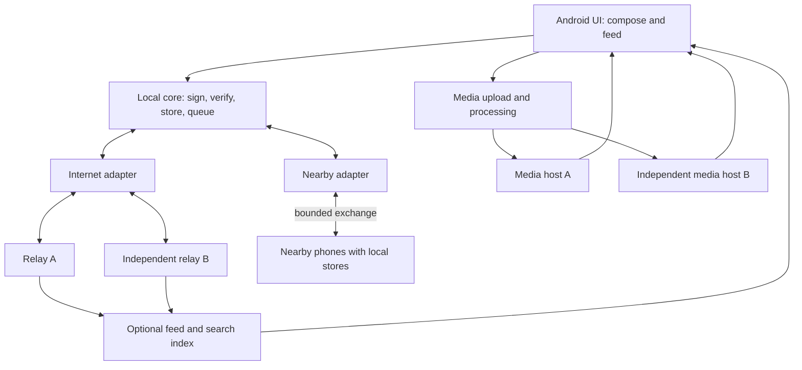

# Freegram implementation plan

Status: proposed plan for review, 25 September 2026. This document describes future work; it does not claim that the new system has been built or field-tested.

Phase 0 working artifacts: [project structure](freegram/PROJECT_STRUCTURE.md), [first-release contract](freegram/PHASE0.md), [threat model](freegram/THREAT_MODEL.md), [dependency/device findings](freegram/PHASE0_FINDINGS.md), and [portable ID fixtures](../protocol/vectors/nip01-id-v1.json). The static artifacts exist; relay, key-storage and physical-device validations remain open.

## Goal and boundary

Build one mobile app that publishes useful public information over the internet and can carry the same signed bulletins between nearby phones when internet access is lost. Add photos and reels after the bulletin path works. A web page can help people read public posts, but it cannot replace the native nearby transport.

This is the **new Freegram direction** in this repository. Existing CrowdOS plans and code are historical inputs, not implementation authority for this plan. Do not delete them before mapping and replacing their useful parts. The earlier [Freegram research](FREEGRAM_RESEARCH.md) recommended AT Protocol for a media-heavy creator network. The protest/outage use case changes the first requirement: a phone must create an event offline that another phone can later publish unchanged. A Nostr-compatible signed event is the starting candidate; Phase 0 must validate that choice rather than assume it solves every social feature.

An unencrypted bulletin forwarded to strangers is public. **Do not offer a “nearby only” privacy guarantee:** a recipient could copy it to the internet outside our app. The initial compose choices are **public bulletin** and **unsent draft**. Private or restricted communication requires a separate encrypted design and is outside the first release. Signatures prove control of a key, not truth or organizational authority.

## System shape

The app stores before sending. A bulletin keeps its author signature and event ID across nearby and internet transport; each recipient verifies it and deduplicates it. A nearby peer may accept a copy without promising further delivery. Internet relay acceptance is a separate status, not proof every user has seen the post. Media bytes are stored by reachable hosts, not kept alive solely by the creator's phone.

Proposed source boundaries: `apps/android` for Kotlin/Compose UI, Room persistence and Android transport; a small versioned protocol module for canonical event validation and test vectors; optional server/index and media-worker modules only when their phases begin. Avoid a microservice per diagram box. Existing `apps/mobile` and `packages/core` must be evaluated during the Phase 1 transition; reusing code is allowed only after its behavior and security assumptions match this plan.

## Model assignment

Use **GPT-6 Sol, medium reasoning**, for the normal implementation loop. Use **GPT-6 Astra, high reasoning**, for protocol, identity, privacy, threat modeling and difficult failure analysis. Use **GPT-6 Luna** only for bounded, low-risk edits after interfaces and acceptance tests are fixed. If using a single model throughout, choose Astra; still require human/device validation. Model recommendations follow [OpenAI's Codex code-generation guidance](https://developers.openai.com/api/docs/guides/code-generation) and [model-selection guidance](https://developers.openai.com/api/docs/guides/model-selection); they are not Freegram benchmarks.

| Phase | Primary model | Review model | Why |
|---|---|---|---|
| 0. Protocol and threat model | Astra high | Human security/product review | Wrong audience, identity or forwarding rules are expensive to undo. |
| 1. Internet vertical slice | Sol medium | Astra high for signing/key code | Most work is app and relay integration; key handling is critical. |
| 2. Reliability and safety | Sol high | Astra high | Reconnect, deduplication and state transitions are failure-prone. |
| 3. Nearby transport | Sol medium for native integration; Astra high for exchange protocol | Astra high plus physical testing | Radio APIs and store-and-forward semantics are separate problems. |
| 4. Offline-to-internet bridge | Astra high | Independent human security review | A leak, replay or false delivery claim affects users directly. |
| 5. Photos and reels | Sol medium | Astra high for availability/privacy review | Media pipeline is substantial; playback and ownership need review. |
| 6. Controlled pilot | Sol for fixes; Astra high for failure analysis | Independent human/field review | Evidence from real devices and users decides release readiness. |

## Phases and exit tests

### Phase 0 — Freeze the first protocol and threat model

1. Write the first user journey: publish public text online, lose internet, exchange it nearby, then bridge it to a relay. Specify whether the *originating* phone or a carrier phone may publish on reconnect; public bulletin means either may.
2. Specify an event schema using an existing signed-event format where possible: author public key, event ID, creation time, body, optional coarse topic/area, expiration hint and signature. Document serialization, maximum size and versioning with test vectors. Avoid automatic precise location metadata.
3. Define local forwarding policy as configurable pilot limits for size, age, hop count, per-peer rate and device storage. An expiry stops our client forwarding; it cannot remove a copied public event. Check Nostr relay behavior against [NIP-01](https://github.com/nostr-protocol/nips/blob/master/01.md) and [NIP-40](https://github.com/nostr-protocol/nips/blob/master/40.md).
4. Specify key creation, device storage, backup, rotation/loss behavior, and author verification. Do not claim hardware-backed protection for a cryptographic key type until verified on target devices.
5. Threat-model phone seizure, spam, fake organizers, malicious peers, relay censorship, radio presence leakage and false rumors. Define what the UI means by “verified”: signature valid, known key, and fact checked are different labels.
6. Select test phones, Android versions, two independent relays and pilot success metrics before implementation. Decide whether the initial Android radio spike uses Nearby Connections and what non-Google fallback must be evaluated.

**Exit:** a short protocol specification, threat model, test vectors and acceptance tests are approved. No product code starts until these are unambiguous.

### Phase 1 — Internet-first Android vertical slice

1. Create a clean Android app shell with Kotlin/Compose, dependency boundaries for domain, persistence and transports, and a simple chronological feed. Keep old app code separate until transition is verified.
2. Implement event creation and verification using a maintained cryptographic library. Store the signing secret using the agreed device-key design; never place it in logs or analytics.
3. Save a draft locally, explicitly publish it, then send the signed event to two configurable Nostr relays. Record each relay's response independently.
4. Subscribe to followed authors, validate incoming events, save them in Room, and display author/key and publish status. Provide relay configuration/export so one operator is not mandatory.
5. Test on two physical Android devices with both relays available, then each relay unavailable in turn.

**Exit:** A publishes and B reads a verified public text bulletin; failure of either one relay does not stop the test.

### Phase 2 — Reliable local state and abuse controls

1. Make local writes transactional: event plus outbox entry. Retry with bounded backoff after airplane mode, process death and reboot. Keep per-relay acceptance rather than one global “sent” flag.
2. Deduplicate by verified event ID; reconcile a bounded history after reconnect. Handle wrong clocks, old events, duplicates, malformed bodies and relay rejection explicitly.
3. Enforce client size, expiry, storage and per-author rate limits. Add block, mute and report controls; don't auto-promote viral or untrusted posts.
4. Implement key export/recovery only according to the Phase 0 security design; test loss and restore on a second device. If safe recovery cannot be validated, label it a release blocker rather than inventing a shortcut.
5. Add automated protocol/storage tests and restart/reconnect tests on devices.

**Exit:** repeated network loss and app restart do not lose locally accepted posts, display duplicates, or claim delivery that did not occur.

### Phase 3 — Nearby exchange and store-and-forward

1. Build a native Android nearby adapter behind the same event-store interface. Start with a two-device radio spike; measure discovery, connection and transfer across the target phone models, including locked-screen behavior.
2. Define the exchange state machine: protocol hello/version, bounded recent-ID inventory, missing-ID request, signed-event transfer, validation, local acceptance acknowledgement and disconnect.
3. Persist validated received events before acknowledging them. Queue only eligible public events for further forwarding; apply age, hop, rate and storage bounds at every hop.
4. Limit disclosure in discovery and inventory exchange. Test malicious input, replay, peer churn, partial transfers and full storage. Transport encryption does not make a public bulletin private from the receiving peer.
5. Run A → B → C with internet disabled and no direct A–C contact. Repeat across phone models, movement patterns and screen states; measure delivery, battery and storage.

**Exit:** C reads and verifies A's bulletin after B carries it. Acknowledgement means B stored it, not that C or the internet received it. Treat [Nearby Connections](https://developers.google.com/nearby/connections/overview) as an evaluation candidate, not a proven censorship-resistant dependency; its Google Play services and data-collection implications must be assessed.

### Phase 4 — Bridge offline bulletins to the internet

1. When a carrier phone reconnects, submit only eligible **public** events. The original author's signature remains unchanged; the carrier cannot edit content without breaking verification.
2. Record relay acceptance, rejection and retry state per event and per relay. A relay's acceptance is not a global delivery guarantee.
3. Sync newly reachable relay events into the local store, deduplicate them against nearby copies, and suppress expired events in the client according to policy.
4. Test A → B → C offline, then C online → independent relay → D online. Test rejected posts, malicious carriers, stale events and replay.
5. Run a security/privacy review of key handling, radio metadata, inventory disclosure, abuse limits, deceptive UI language and incident response.

**Exit:** D sees the verified event after C reconnects; no app-generated upload of unsent drafts occurs. Publish measured delivery and battery results with device/environment details.

### Phase 5 — Photos, then reels

1. Add bounded photo selection, metadata stripping, upload validation and thumbnails. A post references the media only after the upload is complete.
2. Store media at two independently operated hosts and verify the exact bytes or hashes. Test one-host failure and creator-offline retrieval.
3. Add basic feed/profile rendering and reporting for media posts; do not make media follow the nearby bulletin flood path by default.
4. Add video processing with a small adaptive-streaming ladder, thumbnails and standard HTTP playback. Record startup delay, buffering, upload failure and per-view cost.
5. Pilot explicit one-to-one nearby photo transfer separately if users need it; do not promise automatic multi-hop reel distribution.

**Exit:** a new viewer can view an image or play a reel while the creator and one host are offline. Both media availability and moderation behavior are demonstrated, not inferred.

### Phase 6 — Controlled field pilot and release decision

1. Recruit a small real community and at least one operator independent of the Freegram team. Prepare install/update instructions that work in the tested environment.
2. Test short and long outages, blocked relays, movement, phone loss, low battery, false information, spam and moderation response. Record device models and conditions.
3. Review retention, deletion expectations, public-data warnings, abuse reports and legal responsibilities for actual relay/media operators. Obtain independent security review before presenting the app as safety-critical.
4. Fix observed failures, repeat the affected tests and publish a candid limitation list. Expand only after a go/no-go review against the Phase 0 success metrics.

**Exit:** a documented pilot result supports either a limited release or a decision to stop/change the design. No test can prove that information reaches “all people” across disconnected areas.

## Decisions required before Phase 1

- Approve the public-bulletin-first boundary and the absence of a “nearby only” privacy promise.
- Decide whether Nostr-compatible signed events are suitable after Phase 0 test vectors and relay compatibility checks; if not, document a versioned alternative before coding.
- Choose the pilot Android devices, available relays and who will run the independent relay.
- Specify success thresholds for delivery, battery, latency and false-positive moderation using the intended field conditions.

The next implementation artifact after these decisions is a **Phase 1 file-by-file task plan**, with exact modules, interfaces, tests and review gates. This document is the program plan, not permission to claim a production-ready mesh after a successful build.
