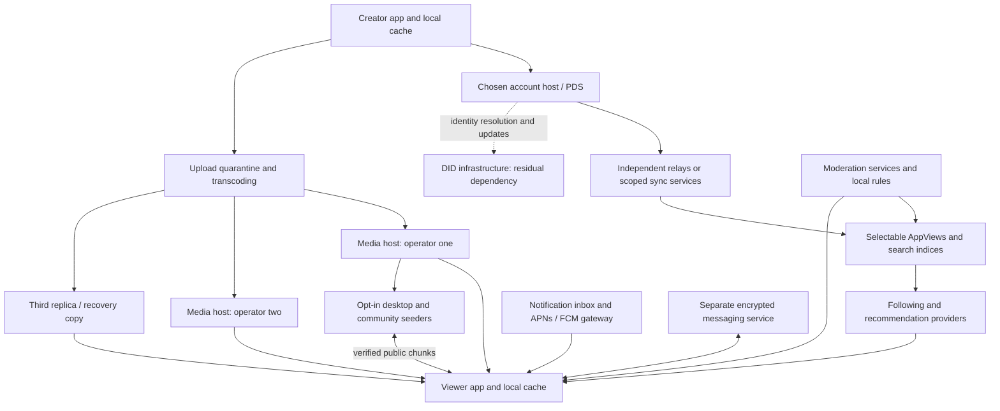
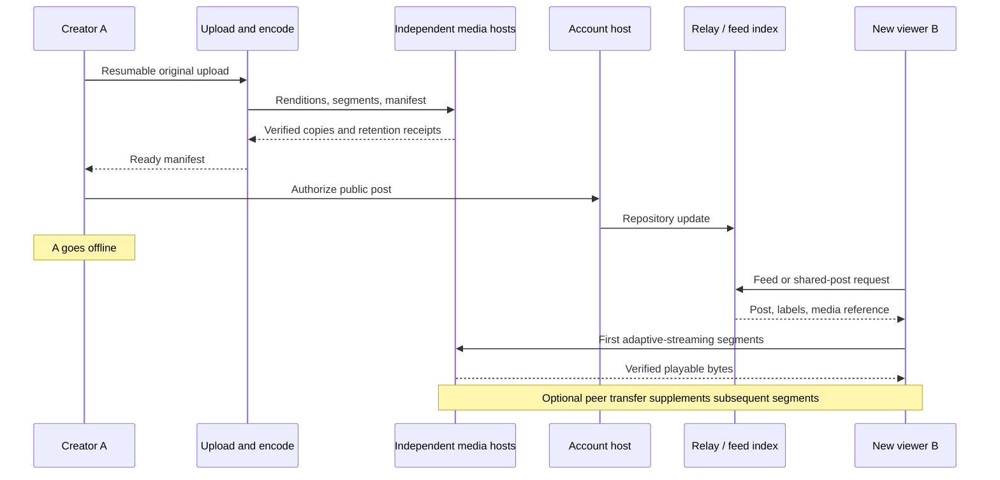

# Freegram: engineering and product feasibility

Research date: 21 September 2026. Status: research and proposed design, not an implemented or validated system.

This report evaluates a media-heavy social network with minimal centralized control. The linked ChatGPT conversation contained an unrelated AI-companion prompt; it supplies no Freegram evidence. Sources below are protocol specifications, project documentation, original research, and official regulatory material. Product hypotheses, engineering judgments, estimates, and experimental targets are explicitly distinguished from observed results. No Freegram device, network, security, or user study was performed.

## 1. Executive conclusion

**Do not build a phone-only, pure-P2P Instagram replacement. Build a portable creator-community product on independently operated services, with P2P as an optional distribution mechanism.**

The fundamental constraint is simple: if the publisher is offline, another reachable machine must retain the bytes. To promise fast playback, that machine also needs sufficient bandwidth, geographical proximity, and operational reliability. These resources have owners and costs regardless of protocol.

Three conclusions have different confidence levels:

| Question | Conclusion | Confidence |
|---|---|---|
| Can public social data and media be distributed without one company operating everything? | Yes; existing federated and relay-based systems demonstrate the components. | High |
| Can volunteer phones alone provide dependable, private, global short-video delivery? | Not a credible default architecture under mobile suspension, churn, NAT, and long-tail demand. | High engineering confidence; Freegram-specific measurements absent |
| Will users switch for portability and feed control? | Unknown. These are plausible benefits, not demonstrated demand. | Low until tested |

Recommended direction: **B, federated supporting infrastructure with optional P2P**, launched through an explicitly temporary **C, hybrid deployment**. Use AT Protocol for public identity/social records, independent media replicas, standard adaptive streaming, replaceable discovery and moderation services, and a local cache. Do not describe this as a primarily phone-to-phone network.

AT Protocol is not a complete answer to your strongest censorship-resistance goal. Its commonly used DID PLC identity method explicitly uses a central directory. Independent AppViews and media hosts cannot eliminate that identity-update dependency. If removal of every network-wide authority is a hard requirement, the recommended foundation fails that requirement today; a Nostr-oriented design trades some of that dependency for more difficult recovery, consistency, and product integration. [DID PLC implementation](https://github.com/did-method-plc/did-method-plc)

The consumer proposition worth testing is: **a useful visual community around a specific interest, with dependable access to chosen creators, a feed the user controls, and memberships that survive changing service providers.** Lower fees and account portability support that proposition. They do not substitute for compelling content and relationships.

Decision: go ahead with a bounded validation programme. Do not fund a general Instagram/TikTok competitor before proving retention, creator benefit, media economics, and recovery.

## 2. Existing systems and lessons

These systems solve different layers. Combining every protocol would create complexity without creating a coherent product.

| System | What it actually contributes | Lesson for Freegram | Limit or trap |
|---|---|---|---|
| BitTorrent + DHT | Peer discovery and verified distribution of file pieces | Fetch independently verifiable chunks from multiple suppliers | DHT locates peers; it does not provide feeds, search semantics, moderation, or durable storage |
| IPFS | Content addressing and a network for discovering/obtaining blocks | Separate media identity from its host; verify received bytes | A CID is not a storage commitment; public provider records leak metadata |
| libp2p | Transports, peer identity, discovery, NAT traversal, relaying | Reuse networking primitives if custom native transfer becomes justified | It is neither a social protocol nor an availability service |
| Nostr | Signed events distributed through selected relays | Portable authorship, multiple relays, replaceable clients | Relay retention/indexing vary; simple public-key identity makes key loss and replacement difficult |
| ActivityPub / Mastodon | Server federation and social activities | Independent communities can operate their own services and policies | Domain/server attachment and cross-implementation differences complicate seamless portability |
| AT Protocol / Bluesky | Repositories, DIDs, PDS hosting, relays, AppViews, feeds, labels | Separate account hosting from discovery and presentation | Public-data design; expensive global aggregation; PLC directory and dominant service defaults remain concentration points |
| Secure Scuttlebutt | Signed per-author logs and offline replication | Local storage and asynchronous synchronization are valuable | Classic append-only feeds create deletion, multi-device, and storage-management difficulties |
| Matrix | Federated room events, device identity, optional E2EE | Messaging needs an explicit device/key/sync model | Replicating room state is not an efficient global reels architecture |
| Briar | Contact-based encrypted synchronization over Tor and local links | Design against a stated adversary; support delayed delivery | Crisis communication priorities differ from globally ranked media |
| Bitchat | BLE mesh messaging plus internet Nostr transport | Nearby communication is useful as a separate mode | Mesh is not global coverage; radio identifiers and proximity remain sensitive |
| PeerTube | Federated video with HLS, P2P assistance, and server redundancy | Most directly relevant media architecture | Available redundancy features do not ensure operators actually replicate videos |
| Pixelfed | Federated photo-oriented social product | Evaluate existing product gaps before inventing a new protocol | Decentralized photos are already a product category |
| Flashes / Skylight | Photo/video and short-video products using the AT ecosystem | Existing social graphs can reduce onboarding friction | Freegram needs differentiation beyond its layout and protocol |

Primary specifications: [BitTorrent DHT](https://www.bittorrent.org/beps/bep_0005.html), [BitTorrent v2](https://www.bittorrent.org/beps/bep_0052.html), [IPFS persistence](https://docs.ipfs.tech/concepts/persistence/), [libp2p AutoNAT](https://libp2p.io/docs/autonat/), [Nostr NIP-01](https://github.com/nostr-protocol/nips/blob/master/01.md), [ActivityPub](https://www.w3.org/TR/activitypub/), [AT overview](https://atproto.com/guides/overview), [Scuttlebutt](https://scuttlebutt.nz/docs/protocol/), [Matrix specification](https://spec.matrix.org/latest/), [Briar design](https://briarproject.org/how-it-works/), [Bitchat repository](https://github.com/permissionlesstech/bitchat), [PeerTube architecture](https://docs.joinpeertube.org/contribute/architecture), [Pixelfed](https://pixelfed.org/), [Flashes](https://www.flashes.blue/), [Skylight](https://skylight.social/).

Specific lessons:

- **Portability has degrees.** Mastodon supports account moves and follower migration where receiving software supports it, but its documentation says posts/media are not imported as part of migration. An export button is not equivalent to preserving the complete account experience. [Mastodon migration](https://docs.joinmastodon.org/user/moving/)
- **Media needs its own portability layer.** Nostr's Blossom integration resolves media using content hashes and alternative servers. Learn the host-independent addressing pattern without assuming every relay stores the media. [NIP-B7](https://github.com/nostr-protocol/nips/blob/master/B7.md)
- **Decentralization must be measured in deployments.** A PeerTube study using an August 2024 crawl found over 92% of observed videos lacked inter-instance redundancy and over half of instances were on seven ASes. This is historical measurement, not a claim about today's network. [Original study](https://privacy-backplane.org/papers/peertube.pdf)
- **NAT traversal is conditional.** A 2026 study reports over 4.4 million attempts across 85,000+ networks and a 70% ± 7.1% hole-punch success rate after prerequisite relay reservation/address discovery succeeded. This is not a universal phone-to-phone connection rate; relay fallback remains necessary. [DCUtR measurement](https://arxiv.org/abs/2604.12484)
- **Protocol openness does not prove demand.** Existing projects establish feasibility of components, not Freegram's retention, economics, or superior recommendations.

Other infrastructure to evaluate, not automatically adopt:

| Candidate | Potential role | Reason not to make it the whole architecture |
|---|---|---|
| Filecoin | Contracted archival storage | Storage and timely retrieval are separate concerns; measure the chosen retrieval service's latency and availability |
| Storj | Distributed object storage and redundancy | Satellite coordination is a control dependency; distributed disks do not imply decentralized governance |
| Arweave | Intentionally permanent public archives | Permanent storage conflicts with ordinary social deletion expectations; avoid for user posts |
| Livepeer | Outsourced/distributed video processing | Transcoding does not solve identity, moderation, persistence, or last-mile playback |
| iroh | Native QUIC connectivity and relay fallback | Useful transport candidate; adds no social graph or automatic media economics |
| Conventional independent object hosts/CDNs | Low-latency replicas | Often the simplest practical solution, but must diversify ownership and prove exit paths |

Sources: [Filecoin retrieval](https://github.com/filecoin-project/filecoin-docs/blob/main/getting-started/what-is-filecoin/retrieval.md), [Storj satellites](https://storj.dev/learn/concepts/satellite), [Arweave design](https://www.arweave.org/files/arweave-lightpaper.pdf), [Livepeer](https://livepeer.org/), [iroh](https://docs.iroh.computer/). Storage-market guarantees must not be mistaken for a video-startup SLA.

## 3. Advantages, disadvantages, and failure analysis

| Strongest possible advantage | Condition required | Failure mode |
|---|---|---|
| Users can leave a provider without rebuilding identity | Tested migrations, keys, backups, compatible clients | Nominal portability that needs a banned/unavailable provider's permission |
| One host cannot delete every public copy | Independent funded replicas | Everyone uses the same cloud, billing account, or CDN |
| Creators can retain direct audience relationships | Stable identifiers and followers' continuing consent | Followers exist in a database but never open the app |
| Users can choose ranking and moderation services | Good defaults and viable alternatives | Default provider becomes the effective authority |
| Communities can govern themselves | Moderators, appeals, budgets, clear boundaries | Volunteer burnout, abuse, ideological capture |
| Open clients enable specialization | Stable interoperable schemas | Fragmentation and incompatible extensions |

The biggest technical problem is reliable low-latency availability under churn. The biggest product problem is giving people a reason to return without their existing social network. The biggest privacy problem is correlating identities, viewing interests, and network addresses. The biggest moderation problem is effective action across independent providers without creating a universal censor. The biggest legal problem is allocating actual operator responsibilities across that network. The biggest economic problem is paying for non-paying viewers and unpopular content.

Freegram could succeed as a focused community product with a sustainable service business. It could completely fail as an undifferentiated clone, a slow app, an abuse magnet, a creator subsidy programme with no retention, or a nominally decentralized service whose defaults all point to one operator.

Expected UX comparison, based on design judgment rather than a head-to-head benchmark:

| User experience | Instagram/TikTok baseline expectation | Proposed Freegram |
|---|---|---|
| First session | Large existing content catalogue and familiar discovery | Narrow curated community; likely weaker broad discovery |
| Playback | Fast continuous video is expected | Can target similar transport quality with funded HTTP replicas; no demonstrated parity yet |
| Posting | Integrated capture, editing, effects, and music | Initially basic upload, caption, thumbnail, and short clips |
| Friends and creators | Existing relationships and familiar names | Biggest initial disadvantage; interoperability only partially helps |
| Feed control | Platform-specific controls and ranking | Explicit Following/Community/Discover choices and replaceable providers |
| Account recovery | Familiar operator-mediated process | Must hide key complexity while preserving a real independent recovery path |
| Hosting choice | Normally invisible to users | Good default plus an optional, tested move-provider workflow |
| Deletion | Users expect removal from the service; external copies remain possible | More cooperating parties and caches; weaker control over independent public replicas |
| Privacy | Users primarily interact with platform infrastructure | Comparable host exposure in HTTP mode; additional stranger-IP exposure in direct P2P mode |
| Support and safety | Users expect a reachable accountable operator | Freegram must provide one for its service, even though the broader network has several |

## 4. Technical architecture

Separate six responsibilities: account hosting, public synchronization, discovery, media storage/delivery, moderation, and private communication. They need compatible interfaces, not a single consensus system.

Proposed implementation uses AT Protocol for public records. Features outside that protocol, especially media replication receipts and manifest extensions below, are **Freegram proposals**, not existing AT guarantees.

| Feature | Proposed mechanism | Consistency/privacy consequence |
|---|---|---|
| Account/profile | Stable DID; handle as changeable alias; profile record in PDS | Display handle is not the identity |
| Following | Follow records owned by the follower | Creator cannot manufacture or transfer another person's consent |
| Followers | Derived reverse index of follow records | Counts may differ temporarily across indexers |
| Posts/reels | Public post record referencing a media manifest | Publish only after upload processing and required replica acknowledgements |
| Likes | One effective relationship per actor/subject; indexed records | Duplicate events are deduplicated; displayed counts eventually converge |
| Comments | Public reply records with root/parent references | Thread views must tolerate missing/deleted parents |
| Feed | Following index plus optional candidate/ranking providers | No global canonical ranking |
| Search | Independently operated indices over selected public records | Search coverage is declared, not represented as complete |
| Notifications | Derived inbox plus push wake-up hint | Lost pushes recover through cursor-based inbox synchronization |
| Multiple devices | Authenticated sessions write through active PDS; local queues | PDS orders writes; do not invent an uncontrolled multi-writer repository |
| Private messages | Separate audited E2EE messaging subsystem | Never place plaintext messages or keys in public repositories |
| Blocking | Client filtering plus service-side interaction restrictions | Cannot prevent an anonymous reader from viewing public content |
| Deletion | Record deletion, cleanup events, cache invalidation, blob reference cleanup | Cannot erase copies held by noncooperating recipients |
| Offline | Cached reads and queued local actions | New global content is unavailable without a route to someone holding it |

Use existing social schemas where they fit. Custom records need versioning, bounds, test vectors, and a documented fallback. A custom Freegram reel schema will not automatically render in Bluesky or other AT clients. Public interoperability requires compatible posts, explicit links, or adoption by those clients.

Public synchronization: verify repository commits, consume cursor-based event streams, deduplicate by repository/record identity and version, checkpoint progress, and reconcile against current repositories after gaps. Do not assume a firehose retains all missed history. A deletion received after a delayed create must not resurrect content. Local queued mutations need stable operation IDs, bounded retries, and explicit conflict handling. [AT repositories](https://atproto.com/specs/repository)

## 5. Architecture diagram



This diagram shows interchangeable roles, not a requirement for a separate microservice per box. The MVP should consolidate application logic into a modular service, while media workers and account hosting have clear process boundaries.

The number of boxes is not a decentralization metric. Operator ownership, cloud dependency, key control, switching costs, and client defaults determine actual control.

## 6. Protocol and data flows

### A uploads a reel; A goes offline; new B watches it

1. **Prepare.** A's app strips unnecessary location metadata, records rights/visibility choices, creates a local draft ID, and requests a quota-limited resumable upload. Public publishing is explicit.
2. **Ingest.** An upload service stores the original in quarantine, checks type/duration/size, validates it in a sandbox, performs applicable abuse checks, and queues transcoding. Failures leave a draft, not a broken public post.
3. **Encode.** Workers create thumbnails and a small adaptive ladder. Initial trial: 360p, 540p, 720p; H.264/AAC compatibility first. Measure codec choices on target phones before adopting AV1/HEVC.
4. **Package.** Produce aligned keyframes and approximately two-second fragmented-media segments. A manifest identifies durations, codecs, dimensions, byte lengths, and hashes for every rendition segment. Different encodings have different hashes. The original and derived renditions are distinct assets.
5. **Replicate.** At least two independently operated online hosts acknowledge verified, complete playable copies and a retention lease. A third recovery copy is desirable. Provider receipts identify manifest hash, provider, expiry, and service policy. Receipts are promises, not proof of future availability.
6. **Commit.** After availability checks, A authorizes a public post referencing the manifest. In the chosen AT deployment, the PDS signs repository commits; do not imply that this automatically proves an uncompromised end-user device approved every post.
7. **Discover.** Relays/sync services ingest the record. Followers' AppViews add it to following-feed candidates. Notifications are optional hints. No follower downloads the entire reel merely by following A.
8. **Distribute.** Initial playback uses a nearby HTTP media host. An opted-in viewer or community node can fetch verified segments from other peers when doing so meets playback deadlines. Cache promotion follows observed demand and budget.
9. **A disconnects.** Playback continues from paid/sponsored replicas. A's phone is no longer on the availability path. If A disconnected before ingest finished, the upload stays pending; the system cannot recreate bytes it never received.
10. **B arrives.** A selected feed/search service, community page, or shared link supplies the post. Being new does not require B to query a DHT for everything or synchronize the whole network.
11. **Resolve and play.** B obtains a current post and moderation view, validates the media reference, resolves host hints, and requests the first segment immediately from HTTP. The player picks a rendition according to throughput/buffer state. Peer discovery, if enabled, runs outside the startup critical path.
12. **Fail over.** On corruption, timeout, or missing segments, try another host. Verify hash failures before accepting bytes. If every copy disappears, show unavailable and attempt repair from a surviving copy; no algorithm can recover vanished information.



### Discovery, NAT, and synchronization

Start with several bootstrap endpoints and signed, cacheable provider lists. Let users/community clients configure alternatives. A service directory itself must not require Freegram's permission for all participation.

Use a DHT later for public media-provider hints if tests show value; a DHT maps a key to potential providers, not a topic to relevant posts. Bound lookups, validate returned content, use expiration, diversify routing, and retain direct host hints. Sybil/eclipse attacks can manipulate lookup results even when hashes prevent forged content. [IPFS censorship research](https://arxiv.org/abs/2307.12212)

For browser P2P, WebRTC requires signaling and ICE connectivity establishment; STUN helps discover reachable addresses and TURN may relay traffic when direct paths fail. Native libp2p/iroh have their own traversal and relay machinery. Relaying every media byte can erase expected bandwidth savings. There is no honest promise that arbitrary phones communicate directly without infrastructure.

PDS or index outages degrade writes/discovery separately from cached playback. After reconnect, reconcile current versions and deletions before surfacing stale feed results. During partitions, prefer explicit pending writes and stale-read indicators over pretending all views are globally consistent.

## 7. Identity, multiple devices, and recovery

Use a DID as stable account identity; handles are human-readable aliases. Verify the handle-to-DID relationship in both directions. Do not tie social edges or payment ownership solely to a username. AT currently supports `did:plc` and `did:web`; the latter ties identity to control of its domain and has no built-in recovery from losing that domain. [AT identity specification](https://atproto.com/specs/did)

Separate authentication, repository signing, and recovery authority:

- **Authentication:** device sessions, short-lived credentials, secure local storage, revocable access. Passkeys can improve login where the chosen account provider supports them; they are not automatically portable repository or recovery keys.
- **Repository signing:** the ordinary hosted PDS model gives the operator signing responsibility. A compromised operator may publish false records. Independent client-held author attestations could reduce this risk but require a separately reviewed extension and client enforcement.
- **Recovery/rotation:** give the user a supported independent rotation/recovery path and encrypted backups of records and media references. Audit actual key priority and update rules; possession of an arbitrary private key is not enough.

Two devices submit writes to the active PDS, which serializes repository updates. Offline devices queue actions. Concurrent caption/profile edits need version preconditions and a visible conflict resolution policy; likes/follows can use idempotent desired-state operations. Never allow device clocks alone to settle authorization or recovery conflicts.

Migration must work in two tests: cooperative old host and completely unavailable old host. The latter needs a recent independent backup, recoverable identity authority, new hosting, and reindexing. Current AT account migration involves copying data and changing DID/PDS/signing state; loss of access to those prerequisites can defeat recovery. [AT accounts](https://atproto.com/specs/account)

**Follower portability is continuity of references, not ownership of people.** Followers referencing a stable DID can keep following after a host change. They can unfollow, providers can filter you, and clients can stop supporting a schema. You cannot import Instagram followers as consenting Freegram relationships. Payment tokens, private messages, bookmarks, and service-specific preferences require separate export/migration handling.

Do not ship home-grown social recovery or threshold cryptography in the MVP. If the user loses all recovery material and all trusted recovery paths, permanent loss may be unavoidable. Say so during setup without making users manage a seed phrase before they see product value.

## 8. Storage, images, reels, and offline distribution

### Media storage and playback

Use immutable media objects plus mutable post references. Thumbnails and image variants have their own hashes. Store descriptive metadata with schema and size limits. Encode once, reuse those exact segments across hosts and peers, and never transcode independently at every cache.

Candidate settings to benchmark, not established optima:

| Parameter | Starting experiment | Why |
|---|---|---|
| Reel limit | 30–60 seconds | Bounds upload, processing, and moderation cost |
| Segment duration | About 2 seconds | Balances request overhead against switching/startup granularity |
| Rendition ladder | 360p / 540p / 720p | Avoids expensive unnecessary high-resolution variants initially |
| Peer connections | Small bounded set | Controls radio, memory, and connection overhead |
| Prefetch | Next likely clip only, capped | Unlimited prefetch wastes paid bandwidth and user data |
| Phone seeding | Off by default; explicit foreground Wi-Fi trial | Protects privacy, data allowance, and battery |
| Durable replicas | Two independent online copies plus recovery copy | Publisher being offline must not break reads |

At 2 Mbps, a 30-second rendition is about 7.5 MB. One million full watches transfers about 7.5 TB before overhead, regardless of whether peers or servers supply it. A ladder plus original may be much larger; the scale model below assumes 60 MB total retained per uploaded clip, not 60 MB per watch.

Swarming works best when several reachable peers need overlapping segments at overlapping times. Short-video feeds fragment demand by clip, rendition, location, time, and buffer position. A video with millions of lifetime views may still have no useful nearby peer for a given viewer.

Illustrative conservation bound: if only 10% of viewers seed, each contributes 1 Mbps, and average consumption is 2 Mbps, same-population upload can cover at most roughly 5% of demand before churn, mismatch, and overhead. Desktop seeders and professional hosts change that bound by adding resources; P2P does not create bandwidth.

Use deadline-aware segment requests, not torrent-style rarity alone. HTTP supplies startup and urgent segments; peers supply segments early enough to matter. PeerTube demonstrates the combination of HLS/P2P and server mirrors, not serverless guaranteed playback. [PeerTube architecture](https://docs.joinpeertube.org/contribute/architecture), [redundancy policies](https://docs.joinpeertube.org/admin/following-instances)

Availability requires paid leases, audits, repair, and quota policies. Maintain a replica inventory, probe randomly and periodically, repair below the required replica count, track expiry, and notify creators before sponsorship ends. Hot caches are disposable; durable replicas are not. Region/cloud/operator diversity matters more than putting three buckets in one account.

Under an unrealistic independence assumption, three copies each reachable with probability 0.9 give `1 - 0.1^3 = 99.9%` reachability. Shared clouds, legal orders, software bugs, and payment failures break that assumption; do not sell this arithmetic as an SLA.

### Can reels match Instagram/TikTok UX?

Hybrid video transport can plausibly achieve competitive startup and buffering on tested networks. Pure opportunistic mobile P2P should not be assumed capable of doing so. Matching an entire consumer experience also requires recommendation quality, creator supply, camera/editor quality, accessible captions, moderation, and fast recovery from failures.

Initial targets: p95 first frame below 1.5 seconds on a declared good-network profile, under 1% rebuffer time, and fewer than 0.5% playback failures. These are Freegram test targets, not measured Instagram/TikTok figures. Use matched device/network trials for comparisons.

### Offline and mesh

| Transport/mode | Realistic use | Poor fit |
|---|---|---|
| Cached local storage | Previously downloaded feeds, photos, clips, drafts | Fetching unseen global content |
| BLE | Discovery, small text, compact metadata, selected tiny thumbnails | Autoplay reels and bulk media |
| Bluetooth data transfer | Small selected exchanges where supported | Assumed universal high-throughput/background operation |
| Wi-Fi Direct | Explicit nearby image/video transfer on supported devices | Seamless universal cross-platform mesh |
| Local Wi-Fi / hotspot | Community cache, event albums, bulk nearby sync | Communication across disconnected locations |
| Store-and-forward | Delayed messages/metadata carried between encounters | Timely delivery without a sufficiently connected encounter graph |
| Multi-hop radio mesh | Small bounded local messages | A city-wide video CDN made of arbitrary phones |

For illustration only, at 100 kbps usable throughput a 10 MB file takes about 800 seconds before retransmissions. This is not a measured BLE rate; it illustrates why the actual measured payload throughput matters more than the advertised PHY rate.

Briar demonstrates local-link synchronization and a mailbox solution for contacts online at different times. Bitchat's current repository describes local BLE plus internet Nostr transport, and explicitly notes a persistent per-device mesh identifier. Neither establishes anonymous, reliable global offline media delivery. [Briar](https://briarproject.org/how-it-works/), [Bitchat](https://github.com/permissionlesstech/bitchat)

Mobile background behavior is an architectural constraint. Apple documents restricted background scanning/advertising; Android Doze defers background network work. Test actual supported OS/device combinations, including locked screens and power-saving modes. Android Wi-Fi Direct APIs do not establish equivalent interoperability on all other platforms. [Apple Bluetooth](https://developer.apple.com/library/archive/documentation/NetworkingInternetWeb/Conceptual/CoreBluetooth_concepts/CoreBluetoothBackgroundProcessingForIOSApps/PerformingTasksWhileYourAppIsInTheBackground.html), [Android Doze](https://developer.android.com/training/monitoring-device-state/doze-standby), [Wi-Fi Direct](https://developer.android.com/develop/connectivity/wifi/wifip2p)

Recommendation: ship cached offline viewing and queued drafts first. Defer mesh. If later justified by a specific event/community use case, use BLE for discovery and Wi-Fi for explicit bulk transfer, with authenticated sessions, quotas, TTLs, deduplication, and user consent. Nearby discovery itself leaks presence.

## 9. Feed, recommendations, and distributed indexing

Provide three understandable modes: Following, Community, Discover. Following should have predictable chronology and a caught-up state. Discover may rank; it must not silently replace Following.

At first, candidate generation uses followed creators, chosen topics, community collections, and language. Apply blocks, applicable service policies, labels, and availability filters before ranking. Use simple quality/freshness/diversity rules; reserve bounded exposure for new creators and monitor abuse of that exposure.

At larger scale, candidate providers return post IDs and reason codes. A selected AppView hydrates records; a client or replaceable ranker applies preferences. Local reranking can keep some interests on-device, but upstream candidates and content delivery still reveal information. An on-device model cannot recommend unseen content without an upstream index or candidate source.

Indexers ingest public repository changes, maintain author/topic/language/media indices, and expose cursors plus coverage/freshness information. Shard services by community, language, region, or data partition as demand grows. Freegram clients merge and deduplicate selected providers; do not make every node index every post.

Cryptographic signatures can authenticate an author's records. They cannot prove that search is complete, a feed is unbiased, or a provider did not omit a post. Independent coverage probes and provider comparison can reveal some omissions, not all censorship.

Measure creator coverage, user-rated usefulness, return visits, session satisfaction, negative feedback, and harassment exposure. Watch time alone rewards compulsive or inflammatory content. Keep private viewing histories out of public event streams. Fraudulent likes/views require statistical and operational defenses, not merely valid signatures.

## 10. Moderation architecture and legal feasibility

### Layered enforcement

1. **Infrastructure policy:** each host decides what it stores and serves, subject to its obligations. Storage and discovery bans are distinct actions.
2. **Default app policy:** Freegram needs clear baseline protections, reports, blocks, rate limits, human escalation, and appeals. Users should not need to configure safety from scratch.
3. **Community policy:** communities select moderators, membership rules, topic boundaries, and interaction permissions.
4. **Optional moderation providers:** signed labels identify issuer, target/version, category, time, expiry, and appeal reference. Clients can combine chosen labelers.
5. **Personal controls:** mute, block, keyword/category filters, reply permissions, and private moderation preferences.

This draws on Bluesky's composable moderation approach, but Freegram must fund its own operations. Independent labels do not make human review unnecessary. [Composable moderation](https://bsky.social/about/blog/4-13-2023-moderation), [operational moderation report](https://bsky.social/about/blog/01-17-2025-moderation-2024)

Distinguish “the author deleted this,” “this host refuses to serve it,” “this index does not list it,” and “your selected filter hid it.” Do not call every action network deletion. A lawful publisher may find another willing provider, but no provider must host everything. User choice cannot override an operator's binding legal duties.

Deletion should remove current records, deindex content, purge cooperating caches, stop serving unreferenced media, propagate cleanup, and observe bounded backup retention. Preserve legally required evidence through a restricted separate process. Public copies, screenshots, exports, and malicious archives cannot be remotely erased. Nostr likewise defines deletion requests rather than guaranteed erasure. [NIP-09](https://github.com/nostr-protocol/nips/blob/master/09.md)

Encryption-key destruction can make certain stored ciphertext inaccessible only if no recoverable key/plaintext copies remain. It cannot revoke already viewed plaintext. Never promise retroactive confidentiality for public posts or paid downloads.

### Why voting is not a safety authority

| Mechanism | Attack/failure | Useful limited role |
|---|---|---|
| One account, one vote | Cheap Sybil accounts | Low-stakes community preference polling |
| Token-weighted votes | Wealth purchases outcomes; bribery | Not a recommended moderation foundation |
| Reputation weighting | Aged-account markets, collusion, insider capture | One contextual signal with capped influence |
| Trust graphs | Infiltration, compromised trusted hubs, exclusion of newcomers | Local spam admission and personalized weighting |
| Majority decision | Coordinated brigading and minority suppression | Community rules with due process, not truth/legal verdicts |
| Cryptographic endorsements | Prove who signed, not whether a claim is true or independent | Auditable provenance of judgments |

Use reports to prioritize investigation. Detect coordinated behavior, rate-limit abusive reporters, diversify reviewers, publish policy reasons, and provide appeals. Avoid automatic global bans from raw vote totals. Proof-of-personhood introduces privacy, access, and issuer-control problems; proof-of-work disadvantages low-end phones and does not stop funded attackers.

### Legal and distribution constraints

This is an engineering issue map, not a jurisdiction-specific legal opinion. Initial market/jurisdiction has not been selected. Commission a role-by-role assessment for client publisher, account host, media host, indexer, message service, and payment operator before public launch.

| Area | Practical consequence |
|---|---|
| EU DSA | Duties depend on role, size, and designation. Hosting/content notice processes and explanations matter; small-company exemptions are not a blanket exemption. Additional large-platform duties cannot be inferred from worldwide MAU alone. |
| GDPR | Public profiles/social graphs can be personal data. Identify controller/processor roles, legal basis, retention, erasure handling, and transfer arrangements. Immutable public replication complicates compliance. |
| India | Assess IT intermediary obligations, current amendments, grievance/compliance roles, and applicable DPDP commencement provisions. Do not rely on the original 2021 rules alone. |
| US child safety | Covered providers have reporting obligations upon qualifying knowledge under 18 USC 2258A. E2EE and decentralization do not erase duties for information an operator does possess. |
| US copyright | Applicable Section 512 safe harbors have conditions, including notice handling and repeat-infringer policies. “Users uploaded it” is not a complete defense. |
| Music/video rights | Instagram-style music libraries need appropriate rights. Creator uploads and cross-posting do not automatically carry transferable music licences. |
| App stores | Distribution depends on applicable user-generated-content moderation and payment policies, even if the underlying protocol is open. |
| Payments | Provider acceptance, fraud, chargebacks, tax reporting, consumer rights, and relevant KYC/AML requirements need market-specific design. |

Official sources: [DSA scope](https://digital-strategy.ec.europa.eu/en/policies/digital-services-act), [DSA questions](https://digital-strategy.ec.europa.eu/en/faqs/digital-services-act-questions-and-answers), [GDPR including Article 17](https://eur-lex.europa.eu/legal-content/EN/TXT/?uri=CELEX%3A32016R0679), [MeitY amended IT Rules FAQ](https://www.meity.gov.in/static/uploads/2025/10/065b6deb585441b5ccdf8be42502a49c.pdf), [DPDP Rules publication](https://www.meity.gov.in/documents/act-and-policies/digital-personal-data-protection-rules-2025-gDOxUjMtQWa?pageTitle=Digit), [18 USC 2258A](https://usc-cdn.house.gov/view.xhtml?edition=prelim&num=0&req=granuleid%3AUSC-prelim-title18-section2258A), [US Copyright Office](https://www.copyright.gov/512/), [Apple guidelines](https://developer.apple.com/app-store/review/guidelines/).

MeitY's February 2026 FAQ describes notified amendments; separate March/April 2026 material describes proposed amendments. Do not treat consultation drafts as enacted law. This report does not establish the exhaustive legal position as of launch. [Official consultation notice](https://www.meity.gov.in/static/uploads/2026/04/ec197f1206279efb4964965f0dede6c1.pdf)

The irreducible trade-off: removing a universal takedown authority also removes a universal abuse-removal authority. You can make the default experience safe and cooperating hosts accountable. You cannot honestly promise that nobody can publish harmful material anywhere, or that no lawful publisher can ever be excluded by infrastructure providers.

## 11. Privacy and security threat model

Protect account authority, private communication, contact/interest data, device resources, publishing integrity, and availability. Assume malicious users, malicious peers, compromised hosts, Sybil operators, stalkers, scammers, hostile network observers, and targeted state blocking. Do not claim protection against a compromised endpoint or a global adversary observing all paths.

| Threat | Protection | Residual risk |
|---|---|---|
| Swarm exposes IP and viewed content | HTTP proxy/host delivery by default; direct P2P explicit opt-in | Host still sees requests; network observers see traffic patterns |
| DHT interest tracking | Phones do not publicly advertise viewing caches; avoid private-content DHT entries | Public suppliers and requests can still be observed |
| GPS/EXIF leakage | Strip metadata by default and offer deliberate location sharing | Images themselves reveal places and people |
| Account theft | Strong authentication, session revocation, independent recovery, alerts | Recovery provider/device compromise remains powerful |
| Impersonation | Stable identifiers, verified handle binding, explicit verified affiliations | Similar names and social engineering remain possible |
| Malicious PDS | Backups, migration drills, independent recovery; possible future author attestations | Hosted signing is a trust boundary |
| Corrupt media | Verify manifest/segment hashes and size bounds | Hash-valid content can still be abusive or exploit a decoder |
| Malicious uploads | Sandboxed decoders/transcoders, limits, patched libraries | New parser vulnerabilities |
| DDoS/resource exhaustion | Quotas, admission control, caches, independent endpoints, bounded work | Large attacks still have costs and shared dependencies |
| Sybil spam/recommendation manipulation | Invites initially; rate/reach limits; behavioral signals; trust context | No universal decentralized proof of honest humanity |
| Discovery eclipse | Multiple bootstrap sources, provider diversity, direct hints, reconciliation | Targeted blocking can still isolate users |
| Malicious federation URLs | SSRF protections, egress isolation, DNS/IP validation, size/time limits | Federation expands attack surface |
| Notification leaks | Opaque push hints, fetch protected inbox separately | APNs/FCM observe delivery metadata |
| Supply-chain compromise | Reproducible builds where feasible, signed releases, dependency review | Distribution stores and update keys retain influence |

IPFS explicitly documents public DHT metadata, and original research demonstrates monitoring of content requests. Content addressing and encrypted transport do not equal anonymous use. [IPFS privacy](https://docs.ipfs.tech/concepts/privacy-and-encryption/), [monitoring study](https://arxiv.org/abs/2104.09202)

Public posts are public even if every connection uses TLS. Private media should use randomly keyed authenticated encryption, encrypted manifests, and recipient-authorized key delivery; public plaintext hashes can leak equality and enable guessing. A paid URL token is access control, not E2EE. Server-side transcoding of private plaintext gives that service access; truly E2EE media must be processed before encryption or through a different explicitly trusted workflow.

For messaging, reuse an audited implementation with device verification, key backup, revocation, forward secrecy, and tested offline delivery. Matrix is a candidate; MLS is a standardized group-security building block, not a complete messaging application. Define metadata exposure and account mapping separately. Defer production DMs until this work is funded. [Matrix E2EE](https://matrix.org/docs/matrix-concepts/end-to-end-encryption/), [MLS RFC 9420](https://www.rfc-editor.org/info/rfc9420/)

Blocking should suppress contact attempts and visibility in your experience. It cannot stop someone making a new identity or retrieving globally public media. For users whose safety requires stronger confidentiality, offer private groups with explicit membership and honest revocation limits, not a misleading public-account block promise.

## 12. Creator monetization and operating economics

Prefer a service business over a speculative token. Candidate revenue: creator hosting subscriptions, paid community memberships, tips, premium moderation/analytics, optional sponsorship tools, and institution-funded community hosting. A free user tier still needs someone to pay its operating costs.

Subscriptions are easier to reason about than per-view micropayments. Aggregate small tips where payment rules permit; processing minimums, custody, and fraud can outweigh tiny transfers. Do not require cryptocurrency or reward raw bandwidth claims. A bandwidth token creates fake traffic and colluding-node incentives unless independently useful delivery can be measured.

Paid content can use authenticated access and, later, recipient encryption. Buyers can copy or record what they see. Access rights may be portable through signed entitlement records, but payment credentials and recurring mandates are not universally portable between processors.

Could Freegram charge less? **Possibly for hosting/community software; not automatically for acquisition, discovery, video delivery, safety, and payments combined.** Lower platform commission can coexist with separate usage bills. Compare total creator net income and workload, not just the advertised take rate.

Illustrative arithmetic, not a provider quote: 1,000 supporters paying $5/month produce $5,000 gross. A 5% Freegram fee yields $250. If a processor charged 3% plus $0.30 per payment, processing would be $450, leaving $4,300 before taxes/refunds/media and other costs. The $250 platform revenue may be inadequate if the creator attracts a large non-paying video audience.

At 1 million MAU, if 1% pay Freegram $5/month, gross platform subscription revenue is $50,000/month. That may cover one lean media configuration, or fail even before staffing under another. Section 15 quantifies why this business cannot assume unlimited free video.

Use clear storage/processing allowances, optional sponsor budgets, and transparent overages. Do not unexpectedly remove already-funded content because it became popular. Separate creator revenue from advertising: an ad marketplace adds advertiser acquisition, brand safety, measurement, and fraud operations and should be deferred.

## 13. Adoption: why use it without caring about decentralization?

The strongest proposed benefit is **a better place for a specific community to follow, discuss, learn from, and support creators**. “Your selected creators remain easy to find; your memberships and identity can move with you” is concrete. “No central server” usually is not.

Candidate starting segment: a regional/language visual-learning community—photography, crafts, food, or another niche with recurring creator output and existing organizer relationships. This is a testable hypothesis, not a researched conclusion that any particular niche will win.

| User | Reason to try | Reason to return | Evidence required |
|---|---|---|---|
| Viewer | A creator/community they already value invites them | Useful exclusive context, discussion, predictable following feed | Unsubsidized repeat visits and user-rated value |
| Creator | Easier community publishing and direct membership tools | Better retained revenue or engagement per hour spent | Measured uplift against their current workflow |
| Organizer | Shared visual archive and community moderation | Lower administrative burden and durable member relationships | Repeated organizer use without founder assistance |

Do not demand that creators abandon Instagram. Offer opt-in publication workflows and shareable public web pages that work before installation. Use creator-owned files and permitted integrations; do not scrape followers or assume music rights transfer. A visitor should get value before creating an account.

| Stage | Proposed approach | Condition before expanding |
|---|---|---|
| First 1,000 users | Recruit 10–20 creators in one cohesive community; manually curate onboarding; run recurring community activities | Users return after novelty and incentives stop |
| 1,000 → 100K | Replicate successful communities, improve creator workflow, community referral, interoperable discovery | Retention and creator benefit repeat across multiple cohorts; support cost is affordable |
| 100K → 1M | Fund regional moderation, broaden service providers, reliable mobile apps, scalable search/media, partnerships | Positive contribution economics and trustworthy operations |

These are strategic stages, not a forecast or promised funnel. Existing AT accounts can reduce registration/social-graph friction, but a text-oriented follow graph does not automatically make a good visual feed. Flashes/Skylight already exploit related opportunities; test against them as well as Instagram.

Possible differentiation—predictable creator access, high-quality niche curation, useful archives, collaborative projects, memberships—can be copied. The durable asset would be community relationships, product quality, and trust earned through real portability. There is currently no evidence that Freegram has that asset.

## 14. Pure P2P, federated support, and hybrid comparison

Ratings below are engineering judgments for this media-heavy consumer use case, not benchmark scores. Architecture A means ordinary user devices carry storage/discovery/delivery without a dependable service tier. B includes independent always-online operators. C begins with Freegram-controlled services plus portable interfaces and external hosting options.

| Dimension | A: pure P2P | B: independently operated support | C: hybrid MVP |
|---|---|---|---|
| Censorship resistance | No single content host, but bootstrap, routing, apps, and access networks remain attack points | Stronger practical continuity if identity/discovery/storage alternatives really work | Limited while Freegram runs defaults; exit paths must be tested |
| Viewer privacy | Direct peers expose addresses/interests unless relayed | Can default to chosen proxy/media providers | Easier to hide IP from strangers; operator sees more metadata |
| Playback | Unreliable long tail and cold starts | Can approach conventional performance with funded replicas | Fastest path to dependable initial UX |
| Cost | Shifted onto users; resource inefficiency may increase | Multiple operators must recover costs; pooling helps | Simple operations initially; concentration and vendor risk |
| Moderation | Effective local filters, weak coordinated removal | Layered service/community policy and portable labels | Stronger consistent default operations, greater operator control |
| Offline | Local content/encounters work | Local cache plus delayed synchronization | Cache/drafts straightforward |
| Scale | Coordination and availability hard under churn | Shard roles; service economies still concentrate providers | Straightforward early scale, harder to decentralize if interfaces are neglected |
| Complexity | Highest product/protocol burden | High, but established components help | Lowest early implementation burden |
| Ordinary-user UX | Keys, missing data, battery and connectivity friction | Can hide infrastructure complexity behind good defaults | Best initial UX, with honestly disclosed dependencies |

Recommended: build C only as a demonstrable subset of B. Before claiming resilience, run at least one deployment under a genuinely independent operator. Two servers controlled by the same founder do not establish independent governance.

## 15. Recommended architecture, scale, and capacity model

Use AT Protocol public data, an independently operable Freegram AppView, a content-addressed media layer with multiple HTTP hosts, and optional P2P public-media transport. Keep private messaging separate. Use local-first caching where it benefits users; do not replicate the global corpus to phones. [Local-first research](https://www.inkandswitch.com/essay/local-first/)

### Honest residual control points

| Dependency | Mitigation | What remains |
|---|---|---|
| DID PLC updates | Independent recovery keys where supported; directory monitoring/backups | Central directory can still affect updates; a read mirror is not an independent write authority |
| DNS/registrars | Stable DID references and multiple service domains | Human-readable names and HTTPS infrastructure remain dependent |
| Default AppView/feed | Documented APIs, alternative provider configuration, exportable preferences | Defaults and economics can produce de facto dominance |
| Media cloud/CDN | Independent copies, alternate delivery paths, tested failure drills | Regional/legal/network outages can correlate |
| APNs/FCM | Durable notification inbox and foreground/poll recovery | Timely background push depends on platform services |
| App distribution | Open source, web access, alternative distribution where permitted | OS/store/network blocking remains possible |
| Payments | Multiple compatible operators and exportable entitlement ledger | Payment providers can decline service |

If these residual dependencies violate the project's non-negotiable goal, stop and reconsider the foundation before product development. Do not promise to solve identity consensus “later” as if it were ordinary refactoring.

### Explicit workload assumptions

All numbers are estimates calculated from the following assumptions, not traffic measurements:

- N means monthly active users, not registrations or daily users.
- DAU = 30% of MAU; every DAU watches 20 minutes/day at average total video/audio bitrate 2 Mbps.
- 30-day month; 20% delivery overhead for speculative fetching/retries. Decimal GB/TB/PB.
- 1% of DAU uploads one 30-second clip/day. Retained original plus variants total 60 MB/clip.
- No deletion in the first year; constant user base; three complete application-level media copies.
- Photos, text, index structures, DB backups, and logs are excluded from media totals.

Formulas:

```text
monthly delivery GB = N × 0.30 × 20 × 60 × 2 / 8 / 1000 × 30 × 1.20
                    = 3.24 × N
new logical media GB/month = N × 0.30 × 0.01 × 0.060 × 30
                           = 0.0054 × N
physical media at end of year 1 = new monthly GB × 12 × 3
                               = 0.1944 × N
```

| MAU | DAU | Delivery/month | Average delivery | New logical media/month | End-year stored media, 3 copies |
|---:|---:|---:|---:|---:|---:|
| 100 | 30 | 324 GB | 1 Mbps | 0.54 GB | 19.44 GB |
| 10,000 | 3,000 | 32.4 TB | 100 Mbps | 54 GB | 1.944 TB |
| 1 million | 300,000 | 3.24 PB | 10 Gbps | 5.4 TB | 194.4 TB |
| 100 million | 30 million | 324 PB | 1 Tbps | 540 TB | 19.44 PB |

Provision peak geography-specific capacity separately; a provisional 3–5× average stress case is an assumption to test. At 100 million MAU that is 3–5 Tbps. If “100 million users” means DAU, multiply this table's workload by roughly 3.33. Watch time and bitrate scale delivery linearly; upload frequency and retention scale storage separately.

At 1 million MAU, the same assumptions imply 3,000 uploads/day and 45,000 source minutes/month to transcode. At 100 million, 300,000 uploads/day and 4.5 million source minutes/month. Benchmark encoding cost per source minute and quality ladder; there is no responsible generic GPU count without that test.

For metadata planning only, assume 100 logged interactions per DAU/day and 1 KB/event: 30 million events/day, about 347 events/sec average, and about 900 GB/month raw at 1 million MAU. At 100 million MAU those become 3 billion/day, about 34,722/sec, and 90 TB/month. These include hypothetical private telemetry, not 100 mandatory public social writes. Indexing, replication, retention, and peaks amplify cost. Collect fewer events where possible.

### Cost sensitivity

For transparent arithmetic, model delivered bandwidth at **$0.005–$0.03/GB** and stored data at **$0.01–$0.025/GB-month**. These are sensitivity inputs, not verified commercial quotes or guaranteed achievable rates.

| MAU | Delivery sensitivity/month | Storage sensitivity/month at end-year footprint |
|---:|---:|---:|
| 100 | $1.62–$9.72 | $0.19–$0.49 |
| 10,000 | $162–$972 | $19–$49 |
| 1 million | $16,200–$97,200 | $1,944–$4,860 |
| 100 million | $1.62M–$9.72M | $194,400–$486,000 |

These are media line items, not all-in operating budgets. Small deployments have minimum service charges; large ones require negotiated capacity. Add transcoding, object requests, replica transfer/repair, database/index hosting, monitoring, DDoS protection, moderation, support, security, legal, and staff. Replication across hosts is not included in viewer-delivery volume.

Current pricing anchors checked for this report: Cloudflare R2 Standard lists $0.015/GB-month, request charges, and no direct egress charge. Cloudflare Stream lists $1/1,000 delivered minutes and $5/1,000 stored minutes/month; encoding is included. These are different service bundles. Free egress does not make requests, processing, independent replicas, or operational service free. [R2 pricing](https://developers.cloudflare.com/r2/pricing/), [Stream pricing](https://developers.cloudflare.com/stream/pricing/)

Under the model, Stream's delivery-only list-price arithmetic before extra prefetch is $18, $1,800, $180,000, and $18M/month respectively. Twenty percent additional billable delivered minutes would increase those numbers by 20%. This is a comparison anchor, not a recommendation or a quote at 100-million-user scale. Budgeting $16,200 for the 1-million-user case assumes a very different delivery arrangement from managed per-minute pricing.

P2P saves money only when useful peer bytes displace paid delivery at more than the added relay, operations, duplicate-transfer, battery, and support costs. Compute **net cost per successfully watched minute**, not just peer byte share. Zero-egress hosting makes the financial case for consumer P2P weaker, even if independently operated seeders still improve resilience.

### How deployment changes with scale

| Scale | Appropriate deployment |
|---|---|
| 100 | Modular service, PostgreSQL, local cache, background media worker, two hosts for resilience testing, manual community moderation. No public DHT or Kubernetes requirement. |
| 10,000 | Automated backups/recovery, reliable job queue, host failover, scoped index, rate limits, moderation queue, billing/quotas; recruit independent operator. |
| 1 million | Regional media caches, partitioned event processing, scalable search, independent AppViews, repair automation, on-call/security/trust-and-safety teams. Benchmark before database sharding. |
| 100 million | Multiple regional service operators, globally engineered media distribution, partitioned indices/graphs, large anti-abuse and compliance operations, codec optimization and infrastructure procurement. No longer a small-team infrastructure problem. |

## 16. MVP architecture and technology stack

Build a narrow public creator-community app, not every Instagram feature.

| Layer | Proposed starting choice | Reason |
|---|---|---|
| Public identity/social data | Existing AT PDS and TypeScript SDKs; OAuth; existing schemas where suitable | Avoid inventing authentication, repository sync, and graph identity together |
| Application backend | TypeScript modular service | Small maintainable codebase; separate domain modules, not premature microservices |
| Persistent application state | PostgreSQL | Transactions, jobs, moderation queues, quota accounting, initial search |
| Web | React/TypeScript public pages and creator tools | Links work before install; low-friction pilot |
| Mobile | React Native with native media players, subject to device spike | Shared product code while preserving native playback; no assumption of browser-equivalent P2P APIs |
| Local cache | SQLite on mobile; bounded browser cache | Offline reads, draft queue, cheap repeat playback |
| Media | FFmpeg workers, HLS/fMP4, S3-compatible object stores at independent operators | Standard playback and portable media assets |
| Search | PostgreSQL initially; dedicated search only when measured necessary | Keeps early operations simple |
| Moderation | Reports/appeals queue and signed-label integration; evaluate Ozone | Operational accountability before automation sophistication |
| Observability | Structured logs, metrics/traces, playback telemetry with privacy limits | Diagnose real user failures and cost |
| P2P experiment | Browser WebRTC/P2P-media-loader or a separate native transport spike | Reuse proven pieces; keep outside required startup path |

Choose one media-processing pipeline. Managed video is acceptable for a throwaway product test, but if it prevents exporting exact renditions/manifests, it cannot validate the final portability architecture. Existing AT blobs and Freegram's multi-host media manifests are distinct integration concerns; enforce upload verification and ownership before public references are accepted.

MVP includes profiles, follows, photos, short reels, chronological feed, simple community discovery, likes/comments, blocks/reports, deletion, backup/export, and an actual host-failure demonstration. A modest second independent operator is more valuable evidence than a large number of founder-controlled nodes.

## 17. What not to build initially

- A new blockchain, token, consensus system, DID method, or cryptographic primitive.
- Mandatory phone seeding, a public DHT on every device, or always-on Bluetooth mesh.
- A globally comprehensive search index and large learned recommendation model.
- General-purpose DMs, encrypted private feeds, or custom group cryptography.
- Live streaming, 4K ladders, a licensed music catalogue, or sophisticated video editing.
- Automated global bans by voting, universal reputation scores, or proof-of-personhood gatekeeping.
- Unlimited free permanent storage or “unlimited reach” guarantees.
- Multiple federation bridges before one protocol and deletion model work reliably.
- A worldwide launch including every age group before moderation and legal operations are ready.

These deferrals deliberately leave the initial product smaller than Instagram. They do not remove the need to design safe interfaces for future features.

## 18. Step-by-step prototype and MVP plan

Effort windows are planning estimates for a small experienced team, not delivery commitments. A production-quality social service cannot be responsibly scheduled from this report alone.

| Step | Work | Exit evidence |
|---|---|---|
| 1: product validation, roughly 2 weeks | Interview 15–20 relevant creators and 30–50 potential viewers; compare current alternatives; test creator workflow and community proposition | Concrete recurring problem, named pilot participants, and willingness to change behavior/pay |
| 2: media/portability spikes, 2–3 weeks | Identical HLS media from two hosts; creator offline; host failure; cold-cache playback; cooperative and failed-host account migration | Recorded latency/failure/cost data and working recovery procedure |
| 3: narrow vertical slice, 3–5 weeks | Publish → replicate → follow → watch → comment/report → delete; web links and local cache | End-to-end user flow with no manual database fixes |
| 4: small closed pilot, at least 4–6 weeks | 100–1,000 participants in one community; instrument cohorts and creator effort | Repeat use after novelty; understood moderation load; measured costs |
| 5: paid value test | Offer one membership or hosting product with real payment/refund handling | Willingness to pay and sustainable contribution, not survey enthusiasm |
| 6: independent operation | Another organization runs a compatible service; migrate real test accounts/content | Users can continue core activity after Freegram-operated services are withdrawn |
| 7: P2P evaluation | Matched HTTP versus assisted playback on real phones/networks | Measurable net benefit without unacceptable privacy/battery/UX regression |
| 8: expansion decision | Review retention, safety, economics, differentiation, and residual centralization | Explicit continue, narrow, pivot, or stop decision |

Do not put P2P implementation ahead of product and HTTP baseline measurements. Without a baseline, bandwidth-sharing activity can look impressive while making the product worse.

## 19. Experiments that can disprove the plan

All thresholds below are proposed decision rules. Pre-register them, cohort definitions, device/network profiles, and exclusions before interpreting results. Report distributions and confidence intervals; a few successful demonstrations are insufficient.

| Assumption | Experiment | Proposed decision rule |
|---|---|---|
| Product is useful without decentralization branding | Community pilot described only by consumer benefits; measure activated-user week-four return | Seek ≥25% week-four return with repeated value reports; <15% after two focused iterations is a strong stop/pivot signal, not a universal industry benchmark |
| Creators benefit | Compare publishing effort, meaningful engagement, and net income with existing workflow over multiple weeks | At least half of pilot creators continue without subsidy and can name a concrete benefit |
| Cold-start reels are acceptable | Low/mid/high devices, warm/cold cache, declared Wi-Fi/mobile profiles, matched HTTP baseline | p95 first frame <1.5 s on good-network profile, <1% rebuffer time, <0.5% failed starts; report weak-network results separately |
| P2P helps | Randomized/crossover HTTP versus P2P-assisted runs; count useful/duplicate/TURN bytes and failed connections | Retain only if ≥20% net delivery-cost reduction in a meaningful cohort with no material playback degradation; otherwise remove from main roadmap |
| Battery impact is acceptable | Controlled repeated 30-minute sessions on physical phones; foreground, locked, charging, Doze; measure energy and thermal state | Pre-agree budget, initially ≤10% energy increase versus equivalent HTTP playback for opt-in mode; no invented measurements |
| Publisher can disappear | Turn off creator device and primary media host; include old unpopular clips | All designated retained test clips remain playable; measure recovery and startup regression |
| Replication is durable | Kill hosts, expire leases, corrupt segments, simulate correlated cloud failure | Detect missing/corrupt copies, repair from independent source, and never report a false healthy replica count |
| Users can leave | Migrate with old host working, then with it completely unavailable | Same DID/follow references work; recover supported content and document every lost setting/key/dependency |
| No mandatory Freegram service | Block Freegram domains and primary index in a controlled test while preserving unrelated network access | Alternate deployment supports read/publish/follow; separately test and disclose PLC/DNS/push dependencies |
| Moderation survives manipulation | Synthetic Sybils, brigades, compromised moderators, appeals, multilingual cases | Raw votes never trigger network-wide removal; measure erroneous restrictions and time-to-action by category |
| Deletion is honest | Delete content with online/offline replicas and stale index consumers | Cooperating online services remove from normal access within chosen SLA; offline nodes reconcile before resurfacing it; document retained evidence/backups |
| Economics work | Track all service bills, processing minutes, safety/support labor, payer conversion, refunds | Positive contribution at observed workload; no assumed future token subsidy or implausible advertising revenue |

P2P evaluation needs audience-overlap variation: one viewer per clip, a viral clip, different renditions, churn, CGNAT, IPv6, blocked UDP, and metered users. A LAN demo with ten laptops watching the same clip cannot establish mobile-feed viability.

Security work needs independent review before sensitive launch claims. Account takeover, malicious media parsing, federation SSRF, authorization, and recovery should be tested before scaling, not only after the product finds users.

## 20. Biggest unresolved problems and final decision

1. **A compelling differentiated product:** no evidence yet that Freegram offers enough incremental value over Instagram, community tools, Pixelfed, Flashes, or Skylight.
2. **Identity authority:** convenient recoverable identity and no shared authority remain in tension; DID PLC leaves a material common dependency.
3. **Affordable long-tail persistence:** popular content can attract caches; forgotten posts still need someone paying to preserve them.
4. **Private viewing:** public P2P delivery exposes metadata; relays/proxies reintroduce operators, latency, and cost.
5. **Safe public replication:** deletion and moderation have bounded reach; backups and immutable copies complicate expectations and legal duties.
6. **Independent operators:** protocol openness does not create capable, funded, diverse providers.
7. **Creator economics:** lower fees do not compensate for lower reach, lower conversion, or higher administrative effort.
8. **Discovery power:** whoever supplies default candidates/ranking can become the effective gatekeeper even without hosting accounts.
9. **Mobile behavior:** actual battery, NAT, background, player, and data-plan performance has not been measured for this design.
10. **Governance and sustainability:** who maintains the protocol, resolves compatibility disputes, pays moderation, and protects exit rights if the company changes ownership?

**Go:** product interviews, a narrow community pilot, two-host media availability, real account recovery/migration, and a matched P2P experiment.

**No-go:** a general-purpose phone-only P2P Instagram clone, universal censorship-proof claims, guaranteed deletion of public copies, or a business model that treats user bandwidth as free infrastructure.

The strongest defensible Freegram would make providers replaceable and community experiences valuable. Its success would be demonstrated when users return for the product and can leave its operator without losing their identity—not by how many networking protocols it contains.
