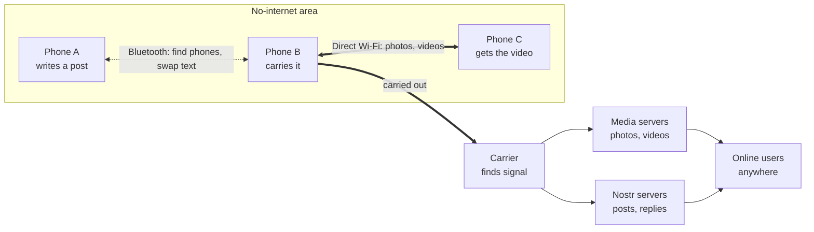
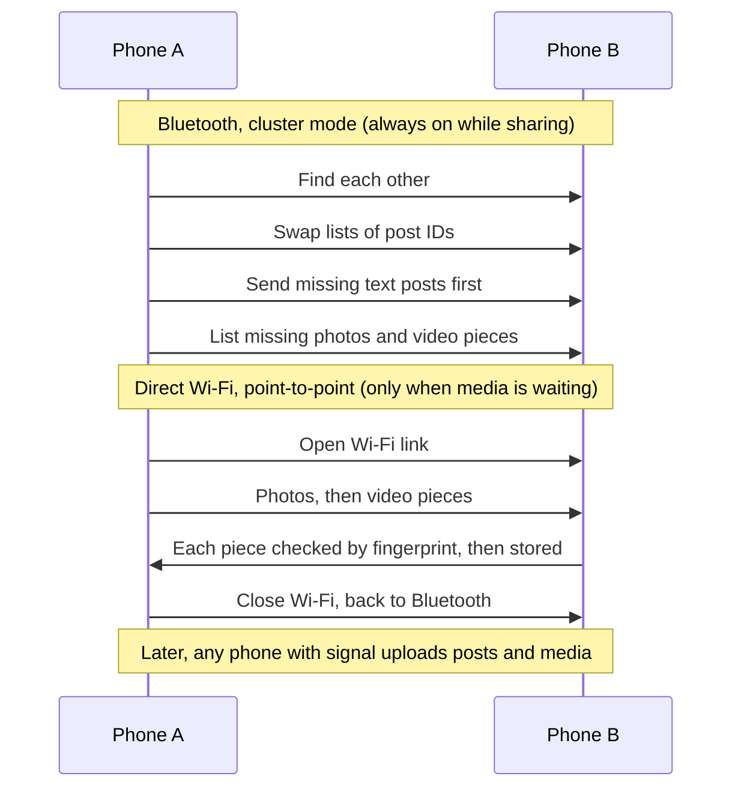

# Offline media and reach plan

Planned features for photos, videos and spreading posts farther in places without internet. Draft, 10 October 2026. Status lives in [PROGRESS.md](PROGRESS.md).

## Goal

People in an area with no internet (a city block, a fest ground, a flooded district) can share text, photos and short videos with each other. Whatever they share reaches the internet as soon as any phone carrying it gets signal, and news from outside flows back in the same way.

## How it works

When two phones meet:

Priority on every meeting: **text first, then photos, then videos**, so urgent news never waits behind a big file.

## Features

### 1. Fast Wi-Fi mode for media

- **What:** photos (and later videos) move over direct phone-to-phone Wi-Fi instead of Bluetooth: about 5 to 30 MB/s instead of 0.1 to 0.3 MB/s.
- **How:** keep Nearby's cluster mode (Bluetooth) for finding phones and swapping text. When the photo round finds something to send, open a second Nearby connection in point-to-point mode, which Nearby upgrades to Wi-Fi Direct or a local hotspot. Send media as Nearby file payloads, then close the link.
- **Wi-Fi prompt:** Android doesn't let apps switch Wi-Fi on. When Nearby starts with Wi-Fi off, show "Turn on Wi-Fi for faster photos and videos" with a button that opens Android's Wi-Fi panel.
- **Effort:** about 1 week. Test on your 2 phones.

### 2. Media servers (photos over the internet)

- **What:** photos (and later videos) reach people online, not only phones nearby.
- **How:** Blossom servers (the Nostr media standard): files stored by their SHA-256 fingerprint, on Cloudflare R2 (free up to 10 GB, then cheap; no download fees). The post's `imeta` tag gains a `url`. Phones upload when online; carriers upload media they received nearby, like they publish posts.
- **Needs from you:** a Cloudflare R2 bucket and an API token.
- **Open questions:** file size limits, how long files are kept, and how hidden or illegal files are removed (see [PRINCIPLES.md](PRINCIPLES.md)).
- **Effort:** about 1 week.

### 3. Videos

- **Limits:** source clips up to about 40 MB; the phone shrinks them to 720p or 480p (usually 8 to 15 MB) and removes location and camera data before posting.
- **Pieces:** each video is split into pieces (for example 256 KB), each with its own fingerprint, listed in a small signed manifest.
  - Pieces can come from **several nearby phones**, so the load is spread out.
  - If someone walks away, the download **resumes later from any phone** that has the rest.
  - Every piece is checked against its fingerprint, so nobody can slip in a fake.
- **Storage:** a setting for media space (200 MB to 1 GB); old videos from others go first, and your own unsent ones are never removed.
- **User message:** "Videos are slower than text and photos. Keep Wi-Fi on and stay close until it finishes."
- **Effort:** 2 to 3 weeks, after features 1 and 2.

### 4. "Send to a nearby phone" (big files, on purpose)

- Two people choose to share one large video directly, like Quick Share. Both phones stay close for a few seconds over Wi-Fi.
- The receiver can pass it on the same way, or it uploads when online.
- **Effort:** a few days, on top of feature 1.

### 5. Reach farther without internet

| Change | Why | Effort |
|---|---|---|
| **Hop setting**: Settings → Nearby → how far posts travel: Short (6), Medium (12, new default), Far (20) | Big areas need more than 6 phone-to-phone hops | 1 day |
| **Carry Discover posts**: keep recent Discover posts on the phone so they're shared nearby | News from outside flows into the area, not only posts from people you follow | 2 days |
| **Longer Nearby**: run until stopped, or 6 hours, with a battery note | Today it stops after 2 hours | 1 day |
| **Names and hide lists over Nearby** | Offline posts show names; moderation keeps working offline | 2 to 3 days |
| **Likes over Nearby** | Counts stay in step offline | 1 to 2 days |

## Protocol changes

- The nearby exchange becomes **version 2**: new frames for the Wi-Fi upgrade, media pieces and video manifests, plus names, hide lists and likes. Phones still speak version 1 to older phones, which then swap text and photos as today.
- Hop and age limits remain transport rules outside the signed post. A dishonest phone can still fake its hop count; limits protect honest phones.
- [protocol/README.md](../../protocol/README.md) gets the new frames and test vectors before release.

## Risks and limits

- **Battery:** the Wi-Fi link opens only while media is waiting, and closes after.
- **One fast link at a time:** most phones hold one Wi-Fi Direct link at a time, so media goes pair by pair; text keeps spreading through the whole crowd.
- **Storage:** videos fill phones fast; limits and cleanup matter.
- **Moderation:** videos are harder to check. Hidden posts' media isn't passed on or uploaded; maintainers can hide by file fingerprint.
- **Play policy:** none of this needs new sensitive permissions. Nearby Wi-Fi uses `NEARBY_WIFI_DEVICES`, which the app already has.

## Build order

1. Reach farther (feature 5: hop setting, carry Discover posts, longer Nearby). Small and quick.
2. Fast Wi-Fi mode for photos (feature 1).
3. Media servers (feature 2).
4. Videos (feature 3), then "Send to a nearby phone" (feature 4).

## Related ideas, later

- **Self-updating website build**: an "Update available" banner and one-tap install (silent on Android 12+), only in the website build, because Play forbids self-updates.
- **SMS fallback**: during shutdowns that cut only mobile data, send short signed posts by SMS to a phone with internet.
- **Own Bluetooth layer**: for phones without Google Play services, and later iPhone to Android.
- **Web app**: so iPhone users in mixed groups can join online.
